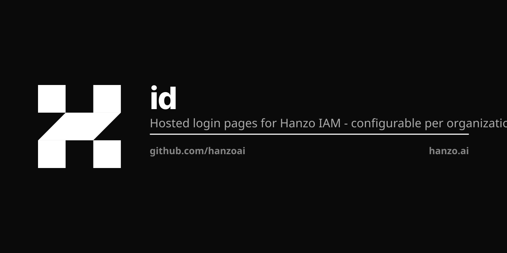

> **Retired — this is a stale copy of `hanzoai/id`.**
>
> Its 4 unique commits are carried into `hanzoai/id` first — merged onto the default branch or pushed there as `carry/*` refs — so nothing here is lost. This copy has no push mirror, so those commits had reached nothing.
>
> It also declared `ghcr.io/hanzoai/id`, the tag `hanzoai/id` owns, so a push here
> could have published over it. That declaration is removed.

<p align="center"></p>

# @hanzo/id

White-label login + identity verification portal. One Vite SPA, four hosts
(`hanzo.id`, `lux.id`, `zoo.id`, `pars.id`), per-tenant brand resolved from
the request hostname at runtime.

## Layout

```
apps/
  web/                Vite + React 19 + @hanzo/gui — the actual SPA
    k8s/              Deployment + Service + Ingress (4 hosts, 4 TLS secrets)
pkgs/
  shared/             @hanzo/id-shared  — TenantConfig + brand resolver
  auth/               @hanzo/id-auth    — composable login/signup/OTP flows
                                          on top of @hanzo/iam SDK
  idv/                @hanzo/id-idv     — pluggable identity verification
                                          (Persona, Onfido, Veriff, stub)
legacy-nextjs/        Frozen — predecessor Next.js implementation. Kept
                     for reference until v0.1.0 ships to production.
```

## Local dev

```bash
pnpm install
pnpm dev                 # http://localhost:5173 (defaults to hanzo brand)
```

To preview a different brand locally, edit `/etc/hosts`:

```
127.0.0.1  lux.id zoo.id pars.id
```

then visit `http://lux.id:5173`.

## Build

```bash
pnpm build               # builds apps/web -> dist/
docker build -t ghcr.io/hanzoai/id:0.1.0 .
```

## Adding a brand

1. Publish or workspace-link the new per-org brand pkg (must ship
   `brand.json` at the package root and match the `BrandContract` shape
   in `pkgs/shared/src/types.ts`).
2. Add a `DEFAULT_TENANTS` entry in `pkgs/shared/src/tenant.ts` OR put
   the override in the runtime catalog (`IAM_TENANT_CONFIG_JSON` env)
   so no rebuild is needed.
3. Add the hostname to `apps/web/vite.config.ts::BRAND_PACKAGES`
   (lets dev + build serve `/brand/<pkg>/brand.json`).
4. Add the hostname + TLS secret to `apps/web/k8s/ingress.yaml`.
5. DNS: CNAME or A record → cluster ingress IP.

That's it — no per-brand Worker, no per-brand image, no per-brand
deployment. One binary, four brands.

## Plugging an IDV provider

```ts
import { registerProvider, createPersonaProvider } from '@hanzo/id-idv'
registerProvider(createPersonaProvider({
  templateId: import.meta.env.VITE_PERSONA_TEMPLATE_ID,
  apiKey: import.meta.env.VITE_PERSONA_API_KEY,
  environment: 'production',
}))
```

The portal stays unchanged — switching providers is a single registration
call at boot.
